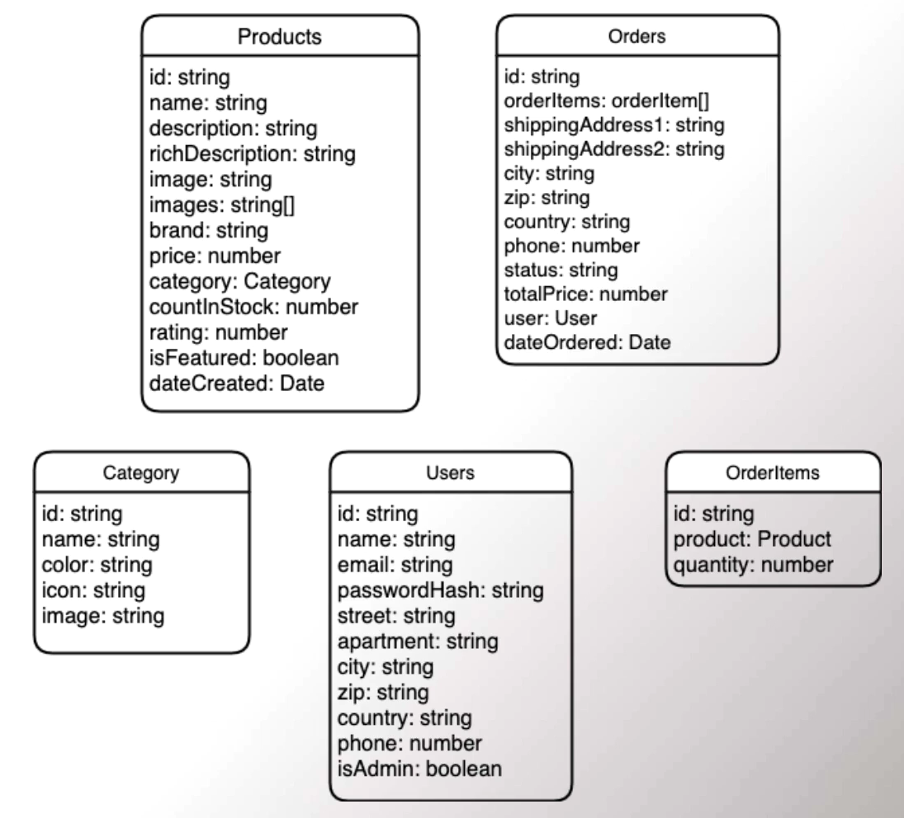

# FreedomGaming-Backend
# daily-deals-server-biswa2210 :star_struck: :computer:

[](https://shields.io/) [](https://shields.io/) [](https://shields.io/) [](https://shields.io/) [](https://shields.io/) [](https://shields.io/) [](https://shields.io/) [](https://shields.io/) [](https://shields.io/) [](https://shields.io/) [](https://shields.io/) 

***This new SERVER OR API FOR DAILY DEALS E-COMMERCE ANDROID APPLICATION is created by Biswarup Bhattacharjee, student of BTECH, in University of Engineering and Management, Kolkata.***

**Email Id: bbiswa471@gmail.com.** 

**Contact No: 916290272740.** 

<p align="left">
<a href="https://www.facebook.com/profile.php?id=100070395300810" target="blank"></a>
<a href="https://instagram.com/biswarup2210" target="blank"></a>
<a href="https://github.com/biswa2210/biswa2210" target="blank"></a>
</p>

## URL :point_right: https://daily-deals-server-biswa2210.herokuapp.com/api/v1/

## What is DAILY-DEALS-SERVER and Why have I made this API :point_down:

<div align="justified">

I have made this DAILY-DEALS-SERVER to work on my e-commerce grocery android application Daily Deals. The application is in my another github repository [daily deals frontend](https://github.com/biswa2210/daily-deals-FrontEnd/tree/master). Using GET, POST, PUT etc requests through specific uniform resource locator(hosted by HEROKU) or through localhost I have done varoius operations on the app. I have added products, categories. I have also created admin users to specify who can work on the app and who is just an user. I have created register and login option. Here using the bearer token user can work as an admin user. Here the data goes to mongoDB from localhost or HEROKU provided hosting and images goes to my firebase account's daily deals project's storage. The development of apps for mobile devices meant that organizations needed to allow users to access information through apps and not just through the Internet. Within the public sector, APIs are used to allow agencies to easily share information and also lets the public interact with government as well. While there are numerous protocols and technologies involved, the underlying purpose of APIs is always the same: to let one piece of software communicate with another. For all these reasons I have made it and worked with it in my android application named Daily Deals.

</div>

## About API :point_down: 

<div align="justified">
 
An application programming interface (API) is a connection between computers or between computer programs. It is a type of software interface, offering a service to other pieces of software. A document or standard that describes how to build such a connection or interface is called an API specification. A computer system that meets this standard is said to implement or expose an API. The term API may refer either to the specification or to the implementation. In contrast to a user interface, which connects a computer to a person, an application programming interface connects computers or pieces of software to each other. It is not intended to be used directly by a person (the end user) other than a computer programmer who is incorporating it into software. An API is often made up of different parts which act as tools or services that are available to the programmer. A program or a programmer that uses one of these parts is said to call that portion of the API. The calls that make up the API are also known as subroutines, methods, requests, or endpoints. An API specification defines these calls, meaning that it explains how to use or implement them. An API (Application Programming Interface) is a set of functions that allows applications to access data and interact with external software components, operating systems, or microservices. API lets a developer make a specific “call” or “request” in order to send or receive information. This communication is done using a programming language called “JSON.”  It can also be used to make a defined action such as updating or deleting data. There are four basic request methods that can be made with API:
<br>GET – Gathers information (Pulling all Coupon Codes)
<br>PUT –  Updates pieces of data (Updating Product pricing)
<br>POST – Creates (Creating a new Product Category)
<br>DELETE – (Deleting a blog post)
<br>JSON (JavaScript Object Notation) is used to represent data on a server. It’s fairly easy to read by humans, and easy for machines/applications to understand.

 
</div>

## About HEROKU :point_down: 

<div align="justified">
 
Heroku is a cloud platform as a service (PaaS) supporting several programming languages. One of the first cloud platforms, Heroku has been in development since June 2007, when it supported only the Ruby programming language, but now supports Java, Node.js, Scala, Clojure, Python, PHP, and Go. For this reason, Heroku is said to be a polyglot platform as it has features for a developer to build, run and scale applications in a similar manner across most languages. Heroku was acquired by Salesforce.com in 2010 for $212 million. Heroku was initially developed by James Lindenbaum, Adam Wiggins, and Orion Henry for supporting projects that were compatible with the Ruby programming platform known as Rack. I have used HEROKU to host my api. I have hosted my API through HEROKU and used that url to further work.
 
</div>


## About POSTMAN :point_down:

<div align="justified">

Postman is a collaboration platform for API development. Postman is a collaboration platform for API development. Postman's features simplify each step of building an API and streamline collaboration so we can create better APIs—faster. This is done by allowing users to create and save simple and complex HTTP/s requests, as well as read their responses. The result - more efficient and less tedious work. Postman is very convenient when it comes to executing APIs. Once we’ve entered and saved them, you can simply use them over and over again, without having to remember the exact endpoint, headers, API keys, etc. I have used it for using the API, GET and POST requests. I have created a workspace here and pasted the link generated by HEROKU and worked with my API on my android application.
 
</div>

## About MongoDB :point_down:

<div align="justified">
 
MongoDB is a source-available cross-platform document-oriented database program. Classified as a NoSQL database program, MongoDB uses JSON-like documents with optional schemas. MongoDB is developed by MongoDB Inc. and licensed under the Server Side Public License (SSPL). MongoDB is an open-source document database and leading NoSQL database. MongoDB is written in C++. Using MongoDB is the Easiest Way to Deploy, Operate, and Scale MongoDB in the Cloud in Just a Few Clicks. I have created project here and here all the categories and products were stored for my android application.
 
</div>

## About Firebase :point_down:

<div align="justified">
 
Firebase is a platform developed by Google for creating mobile and web applications. It was originally an independent company founded in 2011. In 2014, Google acquired the platform and it is now their flagship offering for app development. Firebase provides the tools and infrastructure you need to develop, grow, and earn money from our app. Firebase helps teams from startups to global enterprises build & run successful apps. I have created project here and here all the images were stored for my android application.
 
</div>

### LOCALHOST  :point_down:

<div align="justified">
 
I have made this API testing and run it in localhost where I defined the port number as 5000. So we can run this API in localhost through npm start. Using the API in localhost we can upload image files in uploads folder in public folder using POST REQUEST. Like this I can upload data like categories, products and they will be uploaded in my MongoDb account's(associated with my email id 'bbiswa471@gmail.com') Daily Deal's project's storage https://account.mongodb.com/account/login?n=%2Fv2&nextHash=%23org%2F60ed1689c7b1411657fcd1a5%2Fprojects. The images will be uploaded in my 'daily-deals-images-bucket's storage in https://console.firebase.google.com/project/daily-deals-images-bucket/storage/daily-deals-images-bucket.appspot.com/files in my firebase acount associated with my email id 'bbiswa471@gmail.com'. If a user is 'ADMIN USER' he or she will be able to get details like user details. For this he or she has to use GET REQUEST. We can also work with PUT, DEL etc requests to perform other tasks in backend.
 
</div>

### HEROKUAPP LINK :point_down:

<div align="justified">
 
I have made this API testing and hosted it in HEROKU. I have generated a link through HEROKU. I have used POSTMAN application for POST, GET, DEL, PUT requests for this API where I have created a workspace and pasted the link. Using the API link we can upload image files in uploads folder in public folder in HEROKU app storage using POST REQUEST. After that it will be uploaded in my 'daily-deals-images-bucket's storage in https://console.firebase.google.com/project/daily-deals-images-bucket/storage/daily-deals-images-bucket.appspot.com/files in my firebase acount associated with my email id 'bbiswa471@gmail.com'. If a user is 'ADMIN USER' he or she will be able to get details like user details. For this he or she has to use GET REQUEST. HEROKU filesystem is ephemeral it means it automatically deletes the files from its storage after a span of time. Like this we can also send data like categories, products in my MongoDb account's(associated with my email id 'bbiswa471@gmail.com') Daily Deal's project's storage https://account.mongodb.com/account/login?n=%2Fv2&nextHash=%23org%2F60ed1689c7b1411657fcd1a5%2Fprojects. We can also work with PUT, DEL etc requests to perform other tasks in backend.
 
</div>

### WHY I HAVE USED MONGODB and FIREBASE AFTER USING HEROKU :point_down:

<div align="justified">
 
The Heroku filesystem is ephemeral - that means that any changes to the filesystem whilst the dyno is running only last until that dyno is shut down or restarted. Each dyno boots with a clean copy of the filesystem from the most recent deploy. This is similar to how many container based systems, such as Docker, operate. In addition, under normal operations dynos will restart every day in a process known as "Cycling". These two facts mean that the filesystem on Heroku is not suitable for persistent storage of data. In cases where we need to store data it recommends using a database addon such as Postgres (for data) or a dedicated file storage service such as AWS S3 (for static files). For this reason I have made such an API which finally puts images in firebase storage and data like products and categories in MongoDB. So that all the files and data will be remain in the storage until I delete them.
 
</div>

## Some points about this Daily-Deals-Server :point_down:

 - [x] 'Safe'<br>
 - [x] 'No-one can access'<br>
 - [x] 'easy to use'<br>


## Importance :point_down:

<div align="justified">
  
I have worked on my e-commerce android application Daily Deals with this API. APIs, or application program interfaces, are vital tools for businesses in all industries. The importance of APIs from a technical standpoint, they allow the capabilities of one computer program to be used by another. They are a means by which two different programs are able to communicate. APIs represent more than technical conduits for sharing data. Well-designed APIs provide organizations with a critical link to data and services that enable rapid innovation, open up markets for new goods and services, and serve as the basis for future partnerships. APIs have the potential to transform businesses. Traditional strategies rely on large sales forces, paperwork and other time-consuming, outdated and expensive measures to run their businesses, and the practice is becoming less sustainable all the time. Forward-thinking companies are reducing costs and time spent by “building their solutions with best-of-breed components, which they access via APIs,”
 
</div>

## Folder Structure :point_down:

```bash
daily-deals-server
       ├── helpers
       ├── models
       ├── routers
       └── index.js
```

```bash
models
   ├── category.js
   ├── order-item.js
   ├── order.js
   ├── product.js
   └── user.js
```
I have made some data structures for my application. Using API I have added these accordingly. For products I have specified keywords for Products, Category, Orders, Users, OrderItems. I have worked with following data structures with this API for my application.


<div align="center">
 
<a href="pics/HELPER-SS4.png"></a>
 
</div>

```bash
helpers
   ├── error-handler.js
   └── jwt.js
```
In this part there are 2 main js files. error-handler.js and jwt.js. I have used error-handler.js for getting error notification when registered email id doesn't match with login email id. JSON Web Token is a proposed Internet standard for creating data with optional signature and/or optional encryption whose payload holds JSON that asserts some number of claims. The tokens are signed either using a private secret or a public/private key. JSON Web Token (JWT) is an open standard (RFC 7519) that defines a compact and self-contained way for securely transmitting information between parties as a JSON object. This information can be verified and trusted because it is digitally signed. JWTs can be signed using a secret (with the HMAC algorithm) or a public/private key pair using RSA or ECDSA. This is mainly used for authorization and infromation exchange. When we register and then login with an email id then we will get a jwt as response. Here when we decrypt the encrypted jwt then we will be able to find out if the user is an admin user or not. For this reason jwt is used.
```bash
routers
   ├── categories.js
   ├── order.js
   ├── product.js
   └── users.js
```
We have used different urls to work diffent tasks. We have created different routes to work with categories, orders, products, users. I have used categories routing to add, delete, get categories. I have used products routing to add, delete, get products. I have used orders routing to add, delete, get orders. I have used users routing to add, delete, get users.

## Making :point_down:

<div align="justified">
  


</div>

## Screenshots :point_down: 

<div align="center">

 URL: https://daily-deals-server-biswa2210.herokuapp.com/api/v1/register<br>
 REQUEST: POST<br>
 TASK: This url with this request is used to register in daily-deals-server.<br>
 
<a href="pics/dd1.PNG"></a> 
 
 URL: https://daily-deals-server-biswa2210.herokuapp.com/api/v1/login<br>
 REQUEST: POST<br>
 TASK: This url with this request is used to login in daily-deals-server and a bearer key comes in response which is used for further tasks as an admin user.<br>
 
<a href="pics/dd2.PNG"></a> 
 
<a href="pics/dd2.1.PNG"></a> 
 
 URL: https://daily-deals-server-biswa2210.herokuapp.com/api/v1/users<br>
 REQUEST: GET<br>
 TASK: This url with this request is used to get all users' details of daily-deals-server.<br>
 
<a href="pics/dd3.PNG"></a> 
 
<a href="pics/dd3.1.PNG"></a>

 URL: https://daily-deals-server-biswa2210.herokuapp.com/api/v1/categories<br>
 REQUEST: POST<br>
 TASK: This url with this request is used to add category in daily-deals-server.<br>
 
<a href="pics/dd4.PNG"></a> 
 
<a href="pics/dd4.1.PNG"></a> 
 
 URL: https://daily-deals-server-biswa2210.herokuapp.com/api/v1/categories<br>
 REQUEST: GET<br>
 TASK: This url with this request is used to get all categories of daily-deals-server.<br>
 
<a href="pics/dd5.PNG"></a> 
 
<a href="pics/dd5.1.PNG"></a> 
 
 URL: https://daily-deals-server-biswa2210.herokuapp.com/api/v1/products<br>
 REQUEST: POST<br>
 TASK: This url with this request is used to add product in daily-deals-server.<br>
 
<a href="pics/dd6.PNG"></a> 
 
<a href="pics/dd6.1.PNG"></a> 
 
 URL: https://daily-deals-server-biswa2210.herokuapp.com/api/v1/products<br>
 REQUEST: GET<br>
 TASK: This url with this request is used to get all products of daily-deals-server.<br>
 
<a href="pics/dd7.PNG"></a> 
 
<a href="pics/dd7.1.PNG"></a> 
 
<a href="pics/dd7.2.PNG"></a> 
 
 URL: https://daily-deals-server-biswa2210.herokuapp.com/api/v1/products/gallery-images/:id<br>
 REQUEST: PUT<br>
 TASK: This url with this request is used to add slider images of a product in daily-deals-server.<br>
 
<a href="pics/dd8.PNG"></a> 
 
<a href="pics/dd8.1.PNG"></a> 
 
 URL: https://daily-deals-server-biswa2210.herokuapp.com/api/v1/products/get/featured/:count<br>
 REQUEST: GET<br>
 TASK: This url with this request is used to get all featured products of daily-deals-server.<br>
 
<a href="pics/dd9.PNG"></a> 

 URL: https://daily-deals-server-biswa2210.herokuapp.com/api/v1/products/get/count<br>
 REQUEST: GET<br>
 TASK: This url with this request is used to get count of all products of daily-deals-server.<br>
 
<a href="pics/dd10.PNG"></a> 

 URL: https://daily-deals-server-biswa2210.herokuapp.com/api/v1/products/:id<br>
 REQUEST: DEL<br>
 TASK: This url with this request is used to delete a product in daily-deals-server.<br>
 
<a href="pics/dd11.PNG"></a> 
 
 URL: https://daily-deals-server-biswa2210.herokuapp.com/api/v1/categories/:id<br>
 REQUEST: DEL<br>
 TASK: This url with this request is used to delete a category in daily-deals-server.<br>
 
<a href="pics/dd12.PNG"></a> 
 
 URL: https://daily-deals-server-biswa2210.herokuapp.com/api/v1/users/:id<br>
 REQUEST: DEL<br>
 TASK: This url with this request is used to delete a user in daily-deals-server.<br>
 
<a href="pics/dd13.PNG"></a> 
  
</div>


